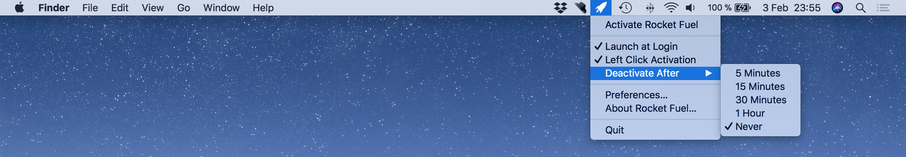

<b>Rocket Fuel</b> is a small, easy to use app that sits discreetly in your menu bar awaiting your command. One simple click <b>prevents</b> your Mac from going to <b>sleep</b> or <b>dimming</b> its display.

With version 2.0, RocketFuel is written entirely in Swift.

Features:
- One Click Activation
- Auto Launch on Startup
- Deactivate After a Preset Time
- Works with Dark Mode in Yosemite
- Support for AppleScript

Requires:
- OS X 10.10 or later.

[Download on the App Store](https://itunes.apple.com/se/app/rocket-fuel/id1114196460?l=en&mt=12)

#### Author
Rocket Fuel is created by <b>Ardalan Samimi</b>.
